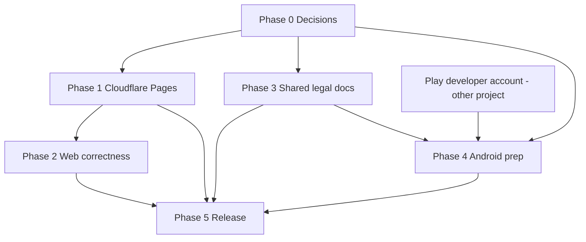

# XegQR - v1.0.0 Release Roadmap

> **Purpose:** What has to be true, and in what order, to release XegQR alongside NetXegManager and PoGoAccountManager. Written for this app specifically: no login, no backend, no database, no email, no Firebase. That removes most of what the sibling roadmaps spend their time on.

**Written:** 2026-10-09 | **Baseline:** `extra.appVersion` 0.1.6, `expo.version` 0.1.0, Android package `com.xegster.xegqr`

## Targets

| Surface | Where | Notes |
|---|---|---|
| Web app | `https://qr.xegster.com.au` | Cloudflare Pages, static export from `expo export -p web` |
| Legal | `https://xegster.com.au/ToS` and sibling pages | `/ToS` is shorthand for the whole set of legal/policy pages Google Play (and similar gates) require. Shared by all three apps and built once as its own phase (Phase 3). XegQR only links to it |
| Android | Google Play | Package `com.xegster.xegqr` already set |
| iOS | Not planned | **Decided:** no iOS for any app until after the Android release, possibly never. `bundleIdentifier` and the encryption flag are already set, so nothing blocks it if that changes |

## What makes this release different from the other two

- **No accounts, no server data.** Nothing a user types leaves the device. There is no account deletion flow, no Firestore rules, no billing tier, no verification email and no SendGrid/DNS mail records. None of that appears below.
- **Web is the primary product, not an afterthought.** The site is a real deliverable (and the cheapest way to get users), so it gets a proper hosting move and security headers rather than "deploy the export somewhere".
- **The privacy story is the selling point and the main legal surface.** It must be accurate about the camera, the photo library, and local storage, because those are the only things the app touches.
- **Some code types carry financial or credential content** (Wi-Fi passwords, authenticator secrets, crypto, SEPA bank transfer, PayPal). That matters for the ToS wording and the Play Console declarations.
- **One shared legal site means a cross-project dependency** that this repo does not control.

## Current state (verified in the repo)

| Area | State |
|---|---|
| Web hosting | **EAS Hosting**, `develop` pushes deploy to the `preview` alias via `.github/workflows/eas-hosting-deploy.yml`. Needs to move to Cloudflare |
| Android OTA | `eas-update.yml` publishes to the `preview` channel on every `develop` push. No production-channel workflow yet |
| Android build | `eas.json` has `development`, `preview` (APK), `production` (AAB). Production has no `autoIncrement` and `app.config.js` has `versionCode: 1` with `appVersionSource: remote` |
| Play submit | `eas.json` points at `./google-service-account.json`. No Play Console app exists yet (assumed) |
| Web storage | IndexedDB via `src/db/store.web.js`; SQLite on native |
| Web scanning | `app/scan.js` already shows a "not available in this browser" panel for browsers without barcode support |
| Legal links in app | None. Settings has no Privacy / Terms entry |
| Docs | README describes EAS Hosting and says "Matches the NetXegManager and PoGoManager projects" |

---

## Phase 0 - Decisions and prerequisites (no code)

| # | Item | Status |
|---|---|---|
| 0.1 | Confirm `xegster.com.au` is an active zone in the Cloudflare account (PoGo's roadmap planned this as E-1; unknown whether it is done) | Open |
| 0.2 | Legal pages are their own shared phase (Phase 3), done once for all three apps | **Decided** |
| 0.3 | Exact page set and URLs (privacy policy, terms, support); settled in Phase 3 | Open |
| 0.4 | Deploys: pushing to the repo must keep building and deploying the web app. Mechanism is an implementation detail | **Decided** |
| 0.5 | iOS | **Decided:** out until after the Android release, maybe never |
| 0.6 | Play developer account | **Not created yet**; coming up in another project. XegQR reuses it (Phase 4) |
| 0.7 | Analytics: recommendation **none**. If Cloudflare Web Analytics is ever turned on, the privacy policy must say so | Open |

---

## Phase 1 - Move web hosting to Cloudflare Pages

Goal: `qr.xegster.com.au` serves the app; EAS Hosting is retired.

| # | Item | Notes |
|---|---|---|
| 1.1 | Create the Pages project `xegqr`, connected to the GitHub repo | Build command `npx expo export -p web`, output directory `dist`, env `NODE_VERSION=22` (matches the workflows). Production branch `main`; `develop` gets a preview deployment automatically |
| 1.2 | First deploy lands on `xegqr.pages.dev` and works | Check by hand: create, style, save, reload (IndexedDB persists), export PNG/SVG |
| 1.3 | Add custom domain `qr.xegster.com.au` to the Pages project | Cloudflare creates the CNAME since the zone is already there. Wait for the certificate to go Active |
| 1.4 | SPA fallback | `web.output` is `single`, so the export is one `index.html`. Pages serves `index.html` for unknown paths when there is no `404.html`. Verify deep links work on hard refresh: `/saved`, `/settings`, `/generate/wifi` |
| 1.5 | Add `public/_headers` | Expo copies `public/` into `dist/`. Contents: `Permissions-Policy: camera=(self)` (the scan screen needs the camera, nothing else needs anything), `X-Content-Type-Options: nosniff`, `Referrer-Policy: strict-origin-when-cross-origin`, `X-Frame-Options: DENY`, and long immutable caching for the hashed `/_expo/static/*` assets. Do **not** set a strict CSP blindly: the SVG export path in `src/services/qrExport.js` and `react-native-svg` use inline styles and blob/data URLs, and a wrong CSP breaks export silently. Add one only after testing |
| 1.6 | `public/robots.txt`, plus `<title>`, description, and social preview tags | Today's title and favicon come from Expo defaults. Set `web.name`, `web.shortName`, `web.description`, `web.themeColor`/`backgroundColor` (`#121212` to match the splash) in `app.config.js`. Optional: a PWA manifest so it can be "installed", which also helps camera permission persistence on mobile |
| 1.7 | Retire EAS Hosting | Delete `.github/workflows/eas-hosting-deploy.yml`. Delete the EAS Hosting deployment/alias in the Expo dashboard. `EXPO_TOKEN` stays; the OTA workflow still uses it |
| 1.8 | Redirects hygiene | Optional: redirect `xegqr.pages.dev` to the custom domain via a Bulk Redirect so there is one canonical URL |

**Deploy behaviour (the requirement):** pushing to `develop` produces a preview deployment and pushing to `main` produces the production site, with no manual step. Connecting the Pages project to the GitHub repo gives exactly that, so it is the default plan. Cloudflare does the build, so the old `eas-hosting-deploy.yml` workflow is deleted once the first Pages deploy works.

*Note:* Cloudflare now promotes Workers static assets over Pages for new projects. The sibling apps chose Pages, so stay consistent.

**Exit:** `https://qr.xegster.com.au` loads over HTTPS, deep links survive refresh, the scan screen asks for the camera on Chrome, and the browser reports no mixed content or console errors.

---

## Phase 2 - Web-specific correctness pass

These are the places a static, device-local app is most likely to disappoint on the web. The existing code already handles some; this phase is a deliberate sweep.

| # | Item | Why it matters |
|---|---|---|
| 2.1 | **Data-loss warning for web storage** | Saved codes and cached logos live in IndexedDB. Clearing site data, private browsing, and Safari's storage eviction for unused sites all wipe them. Add one honest line in Settings or on the Saved screen ("stored in this browser only"). Optional later: export/import of saved codes as a JSON file, which also helps move between web and Android |
| 2.2 | **Camera scanning across browsers** | Needs a secure context (satisfied by HTTPS) and `BarcodeDetector` support. `app/scan.js` already degrades; confirm the message names the real alternative (Android app) and that Chrome desktop, Chrome Android and Safari iOS each behave sensibly |
| 2.3 | **Image export on web** | Confirm PNG and SVG download, copy-to-clipboard and Web Share behave on Chrome, Firefox, Safari (iOS Safari is the usual failure) |
| 2.4 | **Logo upload on web** | `expo-image-picker` falls back to a file input; confirm the per-image size limit and cache-full messages render |
| 2.5 | **Mobile web layout** | Recent commits pinned the QR to the top and wrapped option rows on web. Re-check at 375px and tablet, in both themes |
| 2.6 | **Alerts on web** | `Alert.alert` is a no-op in the browser. `src/utils/crossPlatformAlert.js` exists; grep for any remaining direct `Alert` use |
| 2.7 | **Bundle size / first load** | Single-page export ships everything up front. Check the gzipped JS size; if it is heavy, consider lazy-loading the scan screen (it pulls in the camera module) |

You run these on a real device and browser. Nothing here is checked by tests.

---

## Phase 2b - Android home-screen widget

A widget bound to one saved code; tapping it opens that code full-screen. Full design, work breakdown and risks are in [`WIDGET-PLAN.md`](WIDGET-PLAN.md). It adds a native module, so it forces the `expo.version` / OTA decision in 4.2, and it should land before the closed test (4.10) starts.

---

## Phase 3 - Legal and policy documents (shared with NetXegManager and PoGoAccountManager)

Done once, for all three apps, as its own piece of work. It is the one hard external dependency for the Play listing. Because it is shared, it probably should not live in any of the three app repos; a small dedicated Cloudflare Pages project for `xegster.com.au` is the natural home.

| # | Item | Notes |
|---|---|---|
| 3.1 | Inventory what Play (and similar gates) require | At minimum: a **privacy policy URL** (mandatory, public, names the app and developer), **data safety** answers (a form, not a page, but it must agree with the policy), a **support contact**, and for apps with accounts an **account/data deletion URL**. XegQR has no accounts, but the other two do, so the shared site needs it anyway. A ToS is not strictly required by Play but is wanted for liability |
| 3.2 | Decide the URL layout | Suggest `xegster.com.au/ToS` for terms, with `/privacy` and `/support` beside it, and a section or anchor per app. Pick one casing for `/ToS` and redirect the other |
| 3.3 | Write the documents | Privacy policy, terms of service, support page. Have them reviewed by someone qualified; Australian consumer-law and privacy wording is outside what this repo can decide |
| 3.4 | Support email | An address on `xegster.com.au`; Cloudflare Email Routing can forward it for free. Needed for the Play listing and the policy |
| 3.5 | Deploy and verify | Public, HTTPS, no login wall, readable on a phone |
| 3.6 | Reconcile the sibling apps | PoGo's roadmap planned its own `/privacy`, `/terms`, `/support` under `pogo.xegster.com.au`. Replace them with the shared pages so there are not two conflicting policies |
| 3.7 | In XegQR: one constant for the URLs (`src/utils/legalLinks.js` or similar) and a Settings "About" panel with Terms, Privacy, Support and version | Settings already shows the version. Open with `Linking.openURL` (new tab on web). Can be done as soon as the URLs are final, even before the pages are written |

### Facts for the policy

Everything below is true of the code today. The legal text should be reviewed against it, not the reverse.

- No account, no server, no analytics, no ads in the app. Codes, settings and cached logos are stored on the device only (SQLite / IndexedDB).
- **Camera:** used only on the Scan screen, frames are not recorded or transmitted.
- **Photos:** picking a logo reads the one file the user selects; exporting on Android writes a PNG to the photo library (permission requested only at that moment).
- **Network:** the app makes no requests of its own beyond loading itself. On the web, Cloudflare serves the site and sees standard request metadata (IP address, user agent) in its logs.
- **Content liability:** the app builds Wi-Fi, bank transfer (EPC/SEPA), crypto, PayPal and authenticator (`otpauth`) codes. The ToS should say the user is responsible for the accuracy of what they encode and for what they scan, that codes are generated as-is with no warranty, and that XegQR is not a wallet, bank or payment service.
- Authenticator and Wi-Fi codes contain secrets; the policy should say nothing is uploaded, and the app copy might remind users that a printed code reveals them.

---

## Phase 4 - Android release prep

| # | Item | Notes |
|---|---|---|
| 4.1 | Fix versioning before the first production build | `app.config.js` has `android.versionCode: 1` while `eas.json` uses `appVersionSource: remote`. With remote source EAS owns the code; add `"autoIncrement": true` to the `production` build profile so uploads do not collide. Remove or ignore the config `versionCode` accordingly |
| 4.2 | **Decided: keep `expo.version` as the runtime version** (no reset for 1.0). What it does for OTA | `runtimeVersion.policy: "appVersion"` makes `expo.version` (0.1.0) the OTA compatibility key: an OTA update only reaches builds with the same runtime version. It exists so a JS update that needs a new native module is never delivered to an old binary, which would crash it. While you only change JS, leave it alone. Bump it (an explicit change, your call) whenever a native dependency or permission changes. Before the first Play build there are no installs, so 1.0 is a clean moment to reset it if you want |
| 4.3 | Production OTA channel | Today only `preview` receives updates. Add a production publish step (manual `workflow_dispatch` is enough) targeting `--channel production`, run from `main` only |
| 4.4 | Permissions audit | Confirm the generated manifest requests only camera and, for save-to-gallery, the media permission. `recordAudioAndroid: false` is already set. Remove anything `expo-media-library` adds that is not needed on modern Android (scoped storage) |
| 4.4a | Play developer account | Not created yet. One-time registration fee and identity verification (can take days), shared by all three apps and created in the other project. XegQR waits on it. See 4.10 for why the account type matters |
| 4.5 | Play service account | Create the Google Cloud service account, grant it in Play Console, download the JSON to the repo root, and confirm `google-service-account.json` is gitignored (it is not listed in `.gitignore` today, so add it) |
| 4.6 | Create the Play Console app | Name XegQR, default language, free, app (not game) |
| 4.7 | Store listing assets | Title, short description (80 chars), full description, 512x512 icon (from `assets/icon.png`), **1024x500 feature graphic** (not in the repo), 2-8 phone screenshots in both themes. The README/FEATURES list is good source copy |
| 4.8 | Play Console declarations | Privacy policy URL (0.3). **Data safety:** no data collected or shared (camera frames and selected images are processed on-device only). Content rating questionnaire. Target audience: general. Ads: none. **Financial features:** the app generates bank-transfer and crypto payment QR codes but is not a wallet or financial service; answer the financial-features declaration accordingly. App access: no login, so no test credentials needed |
| 4.9 | Build and test the AAB | `eas build -p android --profile production`, install via internal testing track on a physical device, verify camera, save to gallery, logo picker, and that settings survive an app update |
| 4.10 | Closed test | Newly created **personal** developer accounts must run a closed test with a minimum number of testers for a minimum period before applying for production access (check Play's current numbers when registering). **Organisation** accounts, which need a DUNS number, skip this. The account type chosen in the other project therefore sets the timeline for all three apps. Start the clock as early as possible after the account exists |

---

## Phase 5 - Release and operate

| # | Item | Notes |
|---|---|---|
| 5.1 | Final pre-release checks | `appVersion` bumped (project rule: every merge to `develop`/`main`), README and `docs/FEATURES.md` updated, no stale EAS Hosting references |
| 5.2 | Merge `develop` to `main` | Pages production deploy fires; verify `qr.xegster.com.au` serves the new build |
| 5.3 | Promote Play release | Internal, then production (or closed, per 4.10). Staged rollout is sensible for a first release |
| 5.4 | Cross-links | Link web to Play listing and Play listing to the website. The "App download" QR type already knows the `com.xegster.xegqr` Play URL; make sure the listing is live before relying on it |
| 5.5 | Post-launch watch | Play vitals/crash reports, Cloudflare Pages build and certificate status. No backend to monitor |

---

## Build order

1. **Start now, in parallel:** Phase 3 (shared legal site, owned jointly with the other two apps) and the Play developer account in the other project.
2. Phase 1 (web hosting). It is small, unblocks the real domain, and does not wait on legal.
3. Phase 2 while the Android pieces are being prepared.
4. Phase 3.7 (in-app links) as soon as the legal URLs are final.
5. Phase 4 (blocked on the Play account and Phase 3), then Phase 5.

## Explicitly out of scope for 1.0

- iOS / App Store (decided: after Android, maybe never)
- Accounts, cloud sync, or sharing saved codes between devices
- Dynamic / trackable QR codes, scan analytics, or any server-side feature
- Ads and paid tiers
- Web push, offline PWA beyond what the static export already gives

## Cross-project notes

- **PoGoAccountManager** planned its own legal pages; Phase 3.6 replaces them with the shared set.
- **NetXegManager** uses a different domain (`tmtracker.com.au`). Confirm whether it links to the shared `xegster.com.au` pages or needs its own, since a policy on another brand's domain can look odd on its Play listing.
- This repo's rule that `extra.appVersion` is bumped on every merge to `develop`/`main` also applies to the commit that lands the Pages move.
