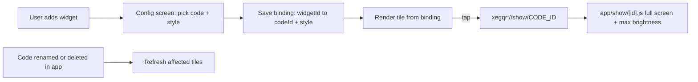

# XegQR - Home-screen widget plan

> **Goal:** an Android home-screen widget that is a styled shortcut to one saved QR code. The widget is **not** the QR code. It is a tile (name, colour, icon). Tapping it opens XegQR on a full-screen view of that code at maximum brightness, ready to be scanned. Planned alongside the Play release work in `docs/RELEASE-ROADMAP.md`.

**Written:** 2026-10-09 (revised same day) | **Baseline:** `extra.appVersion` 0.1.6, `expo.version` 0.1.0

**Status:** implemented in `extra.appVersion` / `expo.version` **0.2.1**, pending the device test checklist below. See "As built" at the end for where the build differs from this plan.

## Scope

| In | Out |
|---|---|
| Android widget = a styleable tile bound to one saved code; several widgets, several codes | Drawing the QR inside the widget (too small to scan reliably, and unnecessary) |
| Per-widget style: colours, gradient, label, icon, size | Web (browsers have no widgets; option hidden) |
| Tap opens a full-screen "show this code" screen with a brightness boost | iOS (not planned before the Android release) |
| Pick the code and style when the widget is added; edit later by re-opening its config | Live/dynamic codes, any network access |

## Decisions

| # | Decision | Status |
|---|---|---|
| D1 | `expo.version` gets a new value with this change (native module added, so OTA must not reach old binaries). Number to use: **0.2.0** unless you prefer 1.0.0 as the reset before the first Play build | **Decided: the 0.2 line** (first committed as 0.2.1) |
| D2 | Widget is a shortcut tile, not a QR render | **Decided** |
| D3 | Widget is styleable | **Decided** |
| D4 | Brightness boost on the full-screen view | **Decided** |
| D5 | Library: `react-native-android-widget` (Expo config plugin, JS-defined widget, config-screen support). Fallback is a hand-written Kotlin `AppWidgetProvider` in a local Expo module. Verify Expo SDK 54 / New Architecture support first | **Verified:** 0.22.1 declares `expo >=54`, ships a TurboModule spec, and supports `backgroundGradient`, `borderRadius` and `SvgWidget` with an SVG string |

### Why tap-to-reveal is dropped

Because the widget never contains the code, it exposes no secret. A Wi-Fi or authenticator code is only displayed after a deliberate tap in the app. The only thing on the home screen is the widget's label, which the user chooses. The one remaining caveat: the label defaults to the code's name, which can itself be revealing (a Wi-Fi SSID, say). The config screen should make the label editable and say so.

## Design

### Data flow



### Storage

A `widgetBindings` record in AsyncStorage (already a dependency):

```
widgetId -> { codeId, label, icon, textColor, background: {type:'solid'|'gradient', colors:[...]}, size, removed }
```

The tile renders purely from this record. It never touches SQLite or the QR payload, so the widget's background JS context needs only AsyncStorage. That is the least fragile arrangement and keeps the widget task handler tiny.

### Styling

Options offered in the config screen, with a live preview of the tile at the top:

| Option | Notes |
|---|---|
| Label | Defaults to the code's name, editable |
| Background | Solid colour or two-colour gradient, plus corner radius |
| Text/icon colour | Auto-picked for contrast from the background (reuse `src/utils/color.js`), overridable |
| Icon | Small set: the QR glyph, the code type's icon (Wi-Fi, link, contact, etc., from `QrIcons.js`), or none |
| Size | Compact (2x1) and large (4x2) as two widget providers, each with a distinct label in the picker |
| Start from | "Match this code's colours" (uses the saved code's own foreground/background/gradient) or the app theme palette |

Reuse the colour field and gradient helpers (`ColorField.js`, `src/theme/gradients.js`) in the config screen, so it looks like the rest of the app.

Checks needed on the library before committing to this list: gradient backgrounds, rounded corners and `SvgWidget` icon support vary by version. If gradients are not supported, fall back to solid colour plus a two-tone accent rather than rendering a bitmap.

### Tap behaviour

- Tile root uses `clickAction="OPEN_URI"` with `xegqr://show/<codeId>`. The scheme is already set in `app.config.js` and `expo-router` maps it to a route.
- New route `app/show/[id].js`: loads the code via `savedCodeRepository.get(id)`, shows the real `QrPreview` with the code's saved style, large and centred on a quiet-zone card, plus the name and a close button. If the code was deleted, show "This code was deleted" with a button to the Saved list.
- The route reads the repository directly rather than waiting on the store, because on a cold start from the widget the library may not have loaded yet.
- The link only displays a local code looked up by id, so it adds no meaningful attack surface. Treat the id as an opaque string and never interpolate it.

### Brightness boost

- Add `expo-brightness`. On the show screen's mount, read the current brightness and set it to maximum. On unmount and when the app goes to the background, restore it.
- Prefer the app/window-level setting (no extra permission). Do not request `WRITE_SETTINGS`; a system-wide change would need a special permission and a Play justification.
- Add a Settings toggle ("Boost brightness when showing a code", default on), stored with the other settings in `useSettingsStore`.
- Consider `expo-keep-awake` on this screen too so the display does not time out while someone scans it. It is another small native module; worth including since the user is holding the phone up to a scanner.
- Web: no-op.

### Staying in sync

| Event | Tile effect |
|---|---|
| Code renamed | Update label only if the user has not customised it |
| Code style edited | No effect (unless the tile is on "match code colours" and the user wants it to follow; default is a one-time copy) |
| Code deleted | Tile shows "Code removed. Tap to choose another", tap opens Saved |
| Tile removed from home screen | Library delete callback drops the binding |
| Tile config re-opened | Edit the style or pick a different code |

Wire this through a small `src/services/widgetSync.js` that is a no-op on web and iOS, called from the repository or store actions so every path is covered.

## Work breakdown

| # | Task | Notes |
|---|---|---|
| W1 | Add `react-native-android-widget` and `expo-brightness` (and optionally `expo-keep-awake`); config plugin entries in `app.config.js`; bump `expo.version` (D1) | Native change; needs a new EAS build. Settle D5 first |
| W2 | `app/show/[id].js` full-screen view with brightness boost | Build this first: it is the tap target |
| W3 | Widget component(s) and task handler (`src/widgets/`) | Two sizes. Register the handler from a small custom entry file that then imports `expo-router/entry`; point `main` at it |
| W4 | Binding store and `widgetSync.js` | AsyncStorage binding record, update/remove helpers, platform guard |
| W5 | Config screen with live preview and styling controls | Registered with the widget library; reuse `ColorField`, gradient helpers, `QrIcons` |
| W6 | Settings: brightness toggle, plus a short Android-only "Home-screen widget" panel explaining how to add one | Long-press the home screen, Widgets, XegQR |
| W7 | Sync hooks for rename/delete | Per "Staying in sync" |
| W8 | Tests | Unit tests for contrast/colour picking and binding logic (you run them). Widget UI is device-tested |
| W9 | Docs | `docs/FEATURES.md`, README, bump `extra.appVersion` |

Suggested order: W1, W2, W4, W3, W5, W7, W6, W8, W9.

## Device test checklist (yours to run)

- Add a widget, pick a code and a style: the tile matches the preview.
- Both sizes appear in the widget picker and render correctly.
- Tap opens the full-screen code; brightness goes to maximum; leaving restores it, including when backing out via the home button.
- Cold start from a tap with the app fully closed.
- Two widgets with different codes and styles stay independent.
- Rename the code: label follows only if not customised.
- Delete the code: tile shows the removed state, tap goes to Saved.
- Remove and re-add widgets; reboot the phone; reopen a tile's config to restyle it.
- Light and dark launcher themes, and at least a Pixel-style and a Samsung One UI launcher.
- Scan the full-screen code with a second phone, including a dense payload.

## Fit with the release roadmap

| Roadmap item | Effect |
|---|---|
| 4.2 `expo.version` / OTA | Decision D1: new version on merge. Do it before any production binary exists |
| 4.4 Permissions audit | No new runtime permissions (window brightness needs none). Re-check the manifest for the widget receiver/config activity only |
| 4.7 Store listing | Add a widget screenshot and a line in the description |
| 4.8 Data safety / privacy policy | No change in what is collected. Policy facts may add: "a home-screen widget stores its label and colours on the device" |
| 4.9 AAB test | Add the checklist above to the internal-track pass |
| 4.10 Closed test | Land the widget before the closed test starts |
| Web (Phases 1-2) | Unaffected. Keep the widget library import behind an Android check and lazy so the web bundle stays clean |

## Risks

| Risk | Mitigation |
|---|---|
| Library lags Expo SDK 54 / New Architecture, or lacks gradients/radius | Verify in D5 before starting. Fallback: solid colours, or a small Kotlin module |
| Custom entry file breaks `expo-router` startup | Keep it to two lines; test a cold start |
| Headless widget context fails on an import | Handler imports only AsyncStorage and widget primitives |
| Brightness not restored after a crash or task kill | Restore on `AppState` change as well as unmount; the window-level setting resets when the activity closes |
| Poor contrast from user-chosen colours | Auto-contrast text, show the existing contrast warning in the preview |
| Launcher differences | Test on two launchers |

## Open questions

1. `expo.version`: 0.2.0 or the 1.0.0 reset? **0.2.x** (first committed as 0.2.1).
2. Include `expo-keep-awake` on the full-screen view? **Yes, on Android and iOS** (the web Wake Lock API rejects in browsers without it, so not there).
3. Should "match this code's colours" stay a one-time copy, or keep following the code's style as it changes? **One-time copy**, as the default above.

## As built

| Area | Where it differs from, or adds to, the plan |
|---|---|
| Removed-code tile | Tap opens an in-app setup route for that tile (`app/widget/[id].js`) instead of the Saved list, so "Tap to choose another" really lets you choose. The same route serves a tile pinned without the launcher's config screen ("Choose a code"). |
| Settings | Besides the help text, "Add small tile" / "Add large tile" buttons use the library's `requestPinWidget`; launchers that refuse get the manual steps in an alert. |
| Saved list | Each code has a **Show** action that opens the full-screen view, so it is reachable without a widget (and on web/iOS). |
| Icon | Stored in the binding as finished SVG (from `QrIcons`' new `iconSvgMarkup`), so the tile needs no icon code at render time. Text colour is stored resolved, with `autoTextColor` remembering it was automatic. |
| Platform split | `.android.js` / `.js` pairs (`src/widgets/register`, `src/services/widgetSync`, `src/widgets/TilePreview`) instead of a runtime-guarded lazy import. Verified: the web export contains no widget-library code. |
| Permissions | `expo-brightness` is auto-applied by prebuild and adds `WRITE_SETTINGS`; `android.blockedPermissions` strips it. |
| Picker preview | No `previewImage` yet, so the widget picker shows the app icon. Add a screenshot of each tile size once one exists. |
